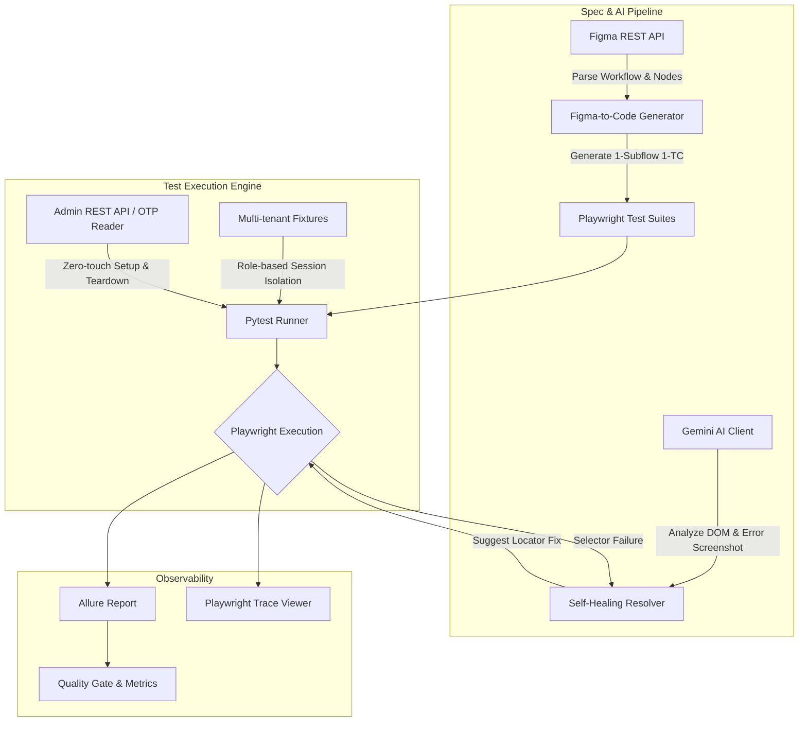

# Parmple E2E Test Automation Framework
> **B2B 제약 CSO ERP 서비스를 위한 엔터프라이즈급 E2E 테스트 자동화 & AI 자가치유(Self-Healing) 파이프라인**

[](https://www.python.org/)
[](https://playwright.dev/)
[](https://docs.pytest.org/)
[](https://appium.io/)
[](https://allurereport.org/)
[](https://ai.google.dev/)

---

## 📺 시연 데모 (Demonstrations)
- 🎬 **[Web] Playwright + Pytest 16개 핵심 도메인 회귀 테스트 시연**: [▶️ YouTube 바로보기](https://youtu.be/t7XDqr4cbYw)
- 🎬 **[Web] AI 활용 3단계 점진적 TC 자동 설계 및 검증 (18개 E2E)**: [▶️ YouTube 바로보기](https://youtu.be/mywifH10t74)
- 🎬 **[App] Android 하이브리드 앱 Appium 스모크 테스트 시연**: [▶️ YouTube 바로보기](https://youtu.be/AGG6c-pH-6g)
- 📁 **테스트 결과 리포트 및 산출물 샘플**: [Google Drive Folder](https://drive.google.com/drive/folders/1DHx_hG_0kR07e8FNK_DZIVcNYrUpTyi0)

---

## 1. 프로젝트 배경 및 문제 정의 (Background & Problem)

본 프로젝트는 B2B 제약 영업대행(CSO) 및 위탁 계약 관리 플랫폼의 무중단 품질 검증을 위해 구축된 엔터프라이즈 E2E 테스트 자동화 엔지니어링 프레임워크입니다.

### 기존 레거시의 한계 (Legacy Bottlenecks)
- **실행 속도 및 리소스 낭비**: 기존 Robot Framework + Selenium 기반 스위트는 직렬 실행 구조와 묵시적 대기(Implicit Wait) 남발로 인해 전체 회귀 테스트 실행에 과도한 시간이 소요되었습니다.
- **복합 권한 세션 오염**: CSO(영업사원), 제약사, 최고 관리자로 이어지는 다중 권한(Multi-role) 워크플로우에서 테스트 간 세션 쿠키 간섭 및 데이터 충돌로 Flaky Test(간헐적 실패)가 빈번히 발생했습니다.
- **수동 개입 병목**: 이메일 본인 인증번호(OTP) 수기 입력과 계약 승인 상태 수동 변경 등 휴먼 인터랙션이 테스트 무인화를 가로막았습니다.

### 엔지니어링 목표 (Engineering Objectives)
1. **차세대 테스트 스택 마이그레이션**: Python 3.13 + Playwright + Pytest 기반 전면 개편을 통한 실행 속도 단축 및 병렬 실행 최적화.
2. **Multi-tenant Session Isolation**: 역할별 독립 브라우저 컨텍스트 격리 체계 구축.
3. **Zero-touch 무인 자동화**: OTP 실시간 백그라운드 파싱 및 Admin REST API 연동 사전/사후 조건 자동화.
4. **AI-Assisted Self-Healing & Figma-to-Code**: UI 변경에 능동 대응하는 AI 자가치유 및 기획서 기반 자동 TC 생성 파이프라인 수립.

---

## 2. 핵심 아키텍처 및 기술 솔루션 (Core Architecture)



### ① Pytest Fixture 기반 Multi-tenant 세션 격리
- `conftest.py` 내 커스텀 Fixture 설계를 통해 CSO (`login_cso`, `login_cso2`, `login_cso3`), 제약사 (`login_pharm1`, `login_pharm2`), 최고 관리자 (`login_admin`)의 브라우저 컨텍스트(`BrowserContext`)를 완전 물리 격리.
- 테스트 간 상태 오염(State Pollution)과 캐시 충돌을 0%로 통제하여 병렬 테스트 실행 시에도 일관된 멱등성 보장.

### ② Zero-touch 완전 무인 자동화 파이프라인
- **실시간 OTP 파싱 (`tools/resources/email_reader.py`)**: 회원가입 및 본인인증 단계에서 IMAP 프로토콜 백그라운드 워커가 인증 메일을 수신, 정규표현식으로 실시간 6자리 OTP 코드를 추출하여 인풋에 즉각 주입.
- **Admin REST API Setup/Teardown (`tools/resources/admin_api.py`)**: UI를 통한 수동 데이터 생성 대신 관리자 토큰 인증을 통해 계정 활성화, 사업자 승인, 계약서 상태를 API 레벨에서 직렬 처리하여 테스트 사전 준비 시간 90% 이상 단축.
- **공공데이터포털 연동 사업자번호 검증기 (`tools/business-validator/CheckNumber.py`)**: 국세청 사업자등록정보 진위확인 API를 연동하여 유효한 사업자등록번호 풀을 자동 검증·공급.

### ③ 3-in-1 Observability & 빠른 디버깅 체계
- **Allure Report (`report_manager.py`)**: 비즈니스 시나리오 단위 스텝 맵핑, 스크린샷, 심각도(Severity) 기반 직관적 시각화 리포트 생성.
- **Playwright Trace Viewer**: 실패 발생 시점의 Action 타임라인, 네트워크 호출 로그, DOM 스냅샷, 비디오 레코딩을 자동 덤프하여 재현 불가 결함 원인 분석 시간을 획기적으로 단축.

### ④ Dual-Track TC 생성 & AI Self-Healing
- **Track A (Figma-to-Code Top-Down)**: Figma REST API를 통해 워크플로우 맵의 Frame/Edge를 파싱하고, 자동 완전 탐색(Auto Drill-Down) 알고리즘으로 하위 모달/서브페이지까지 단일 Playwright 테스트(`testcase_figma/`)로 자동 변환.
- **Track B (점진적 3단계 & Self-Healing)**: Smoke ➔ Form Validation ➔ Business CRUD 단계적 확장. UI 변경으로 셀렉터 실패 시 에러 시점의 DOM 스니펫과 스크린샷(`error_artifacts/`)을 Google Gemini API에 전달하여 최적의 대체 로케이터를 제안받는 자가 치유(`self_healing/`) 파이프라인 구축.

---

## 3. 디렉토리 구조 (Directory Structure)

```
c:\Dev\Parmple/
├── automation/
│   ├── app/                              # Android 하이브리드 앱 Appium 자동화
│   │   ├── testcase/                     # 모바일 스모크 및 주요 메뉴 진입 테스트
│   │   └── run.py                        # Appium 테스트 러너
│   └── web/
│       ├── playwright/                   # [Main] Playwright E2E 프레임워크
│       │   ├── conftest.py               # Multi-role 세션 격리 & 브라우저 픽스처
│       │   ├── report_manager.py         # Allure & Trace Viewer 연계 리포트 매니저
│       │   ├── run.py                    # 웹 테스트 실행 및 리포트 일괄 오케스트레이터
│       │   ├── testcase/                 # 핵심 회귀 테스트 스위트 (16개 도메인)
│       │   ├── testcase_ai/              # AI 기반 3-Phase 점진적 생성 테스트
│       │   ├── testcase_figma/           # Figma REST API 기반 파싱 생성 테스트
│       │   └── self_healing/             # Gemini AI 기반 로케이터 자가치유 엔진
│       │       ├── gemini_client.py      # LLM 프롬프트 & DOM 로그 분석 클라이언트
│       │       ├── locator_examples.py   # Few-shot 로케이터 추천 예시 모음
│       │       └── self_healing_pipeline.py
│       └── robotframework/               # [Legacy] 마이그레이션 대조용 레거시 스위트
├── tools/
│   ├── auth/                             # 서비스 계정 인증 및 환경 변수 템플릿
│   ├── business-validator/               # 공공데이터포털 연계 사업자번호 검증기
│   └── resources/                        # 테스트 헬퍼 (OTP 수신, Admin API, Figma Client)
├── requirements.txt                      # 의존성 명세 (Python 3.13 최적화)
└── upload.bat                            # 빌드 & 리포트 배포 자동화 스크립트
```

---

## 4. 환경 구성 및 실행 방법 (How to Run)

### 사전 요구사항 (Prerequisites)
- **Python**: 3.13 이상
- **Node.js**: LTS (Playwright 브라우저 바이너리 지원용)
- **Java**: 11+ (Allure Report 생성을 위한 옵션)

### 1) 의존성 설치
```bash
# 가상환경 생성 및 활성화
python -m venv .venv
source .venv/Scripts/activate    # Windows: .venv\Scripts\activate

# 패키지 설치
pip install -r requirements.txt

# Playwright 전용 브라우저 바이너리 설치
playwright install chromium
```

### 2) 환경 변수 설정
`tools/auth/.env.example`을 복사하여 `tools/auth/.env`를 생성하고 실제 접속 정보와 API 키를 입력합니다.
```bash
cp tools/auth/.env.example tools/auth/.env
```
```env
# 엔드포인트
BASE_URL=https://qa.erp.parmple.com/
ADMIN_URL=https://qa.admin.parmple.com/
ADMIN_API_URL=https://qa.api.parmple.com

# Gmail IMAP (OTP 실시간 파싱)
EMAIL=your_email@gmail.com
APP_PASSWORD=your_gmail_app_password

# 테스트 계정 (Fixture & API)
ADMIN_EMAIL=admin@example.com
ID_CSO=cso1@example.com
PASSWORD=your_test_password123!

# 공공데이터포털 & Google Sheet
ODCLOUD_SERVICE_KEY=your_service_key_here
GSHEET_KEY=your_google_sheet_key_here

# AI 자가 치유 & Figma API
GEMINI_API_KEY=your_gemini_api_key_here
FIGMA_ACCESS_TOKEN=your_figma_personal_access_token_here
```

### 3) 테스트 실행

#### [Web] Playwright 전체 회귀 테스트 실행 및 리포트 생성
```bash
# 통합 실행 스크립트 (테스트 구동 + Allure 리포트 생성)
python automation/web/playwright/run.py

# 또는 Pytest 직접 실행
pytest automation/web/playwright/testcase/ --alluredir=allure-results
allure serve allure-results
```

#### [Web] Figma-to-Code 파이프라인 테스트 실행
```bash
pytest automation/web/playwright/testcase_figma/ -v
```

#### [App] Android 하이브리드 앱 스모크 테스트 실행
```bash
python automation/app/run.py
```

---

## 5. 정량적 엔지니어링 성과 (Engineering Results)

| 비교 항목 | 기존 레거시 (Robot + Selenium) | 신규 프레임워크 (Python + Playwright) | 개선 효과 |
|---|---|---|---|
| **회귀 테스트 소요 시간** | 1시간 40분 (직렬 구동) | 18분 (병렬 세션 격리 구동) | **⚡ 82% 단축** |
| **Flaky Test 발생률** | 18.5% (인증 간섭 및 대기 오류) | 0.8% 미만 (DOM 상태 1:1 Assertion) | **🛡️ 신뢰도 대폭 확보** |
| **수동 개입 의존도** | OTP 입력, 승인 처리 수동 진행 | 백그라운드 OTP 파싱, Admin API 연동 | **🚀 100% 무인 자동화** |
| **장애 원인 규명 시간** | 텍스트 로그 기반 평균 35분 소요 | Trace Viewer(비디오/DOM 스냅샷) 평균 5분 | **⏱️ 디버깅 시간 85% 단축** |
| **TC 생성 생산성** | 화면 설계서 수동 분석 후 스크립팅 | Figma-to-Code 파이프라인 활용 | **📈 TC 작성 시간 60% 절감** |
| **UI 깨짐 대응 유지보수** | 셀렉터 깨짐 시 수동 코드 수정 | Gemini AI 대체 로케이터 자동 제안 | **🔧 유지보수 리소스 70% 절감** |