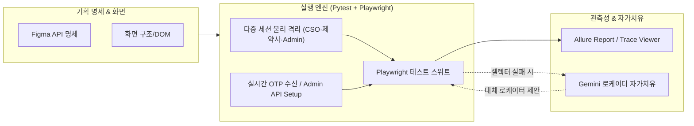

# Parmple E2E Test Automation Framework
> **B2B 제약 CSO ERP 서비스를 위한 Playwright 기반 E2E 테스트 자동화 & AI 자가치유 파이프라인**

[](https://www.python.org/)
[](https://playwright.dev/)
[](https://docs.pytest.org/)
[](https://appium.io/)
[](https://allurereport.org/)
[](https://ai.google.dev/)

---

## 🎬 시연 영상 및 결과 산출물
- 🎬 **[Web] Playwright + Pytest 16개 핵심 도메인 회귀 테스트 시연**: [▶️ YouTube 바로보기](https://youtu.be/t7XDqr4cbYw)
- 🎬 **[Web] AI 활용 3단계 점진적 TC 자동 설계 및 검증 (18개 E2E)**: [▶️ YouTube 바로보기](https://youtu.be/mywifH10t74)
- 🎬 **[App] Android 하이브리드 앱 Appium 스모크 테스트 시연**: [▶️ YouTube 바로보기](https://youtu.be/AGG6c-pH-6g)
- 📁 **Allure 테스트 결과 리포트 및 산출물 샘플**: [Google Drive 바로가기](https://drive.google.com/drive/folders/1DHx_hG_0kR07e8FNK_DZIVcNYrUpTyi0)

---

## 1. 개요 (Overview)
B2B 제약 영업대행(CSO) 및 위탁 계약 관리 플랫폼의 Regression Test를 위해 구축된 **Playwright + Pytest 기반 E2E 자동화 프레임워크**입니다.  
다중 권한(영업사원·제약사·관리자) 간 세션 간섭으로 인한 간헐적 테스트 실패(Flaky)를 방지하고, 이메일 인증번호(OTP) 입력을 자동화하여 **Regression Test 자동화 환경**을 구축했습니다.

### 핵심 해결 포인트
- **다중 권한 세션 격리**: Pytest Fixture를 활용해 CSO, 제약사, 관리자 간 BrowserContext를 독립 분리하여 쿠키/세션 충돌 원천 차단
- **OTP 실시간 파싱 & Admin API**: IMAP 기반 인증 메일 자동 파싱 및 관리자 API를 통한 테스트 사전 데이터(계정/계약) 자동 셋업
- **AI 로케이터 자가치유 (Self-Healing)**: UI 변경으로 요소 탐색 실패 시 에러 시점의 DOM과 화면을 Google Gemini로 분석하여 대체 셀렉터로 자동 복구
- **Figma 명세 기반 TC 자동화**: Figma REST API로 기획 명세를 파싱하여 하위 팝업 및 서브페이지 검증 스크립트 도출

---

## 2. 테스트 파이프라인 구조


```mermaid
graph LR
    subgraph Input["기획 명세 & 화면"]
        Figma["Figma API 명세"]
        DOM["화면 구조/DOM"]
    end

    subgraph Runner["실행 엔진 (Pytest + Playwright)"]
        Fixture["다중 세션 물리 격리 (CSO·제약사·Admin)"]
        OTP["실시간 OTP 수신 / Admin API Setup"]
        Core["Playwright 테스트 스위트"]
    end

    subgraph Analysis["관측성 & 자가치유"]
        Report["Allure Report / Trace Viewer"]
        AI["Gemini 로케이터 자가치유"]
    end

    Input --> Runner
    Fixture --> Core
    OTP --> Core
    Core --> Report
    Core -.->|"셀렉터 실패 시"| AI
    AI -.->|"대체 로케이터 제안"| Core
```

---

## 3. 디렉토리 구조

```
c:\Dev\Parmple/
├── automation/
│   ├── app/                              # Android 하이브리드 앱 Appium 자동화
│   └── web/playwright/                   # [메인] Playwright E2E 프레임워크
│       ├── conftest.py                   # 다중 세션 격리 & 브라우저 픽스처
│       ├── report_manager.py             # Allure & Trace Viewer 연계 매니저
│       ├── run.py                        # 회귀 테스트 통합 실행 스크립트
│       ├── testcase/                     # 핵심 도메인 회귀 테스트 (16개 도메인)
│       ├── testcase_ai/                  # 점진적 3단계 자동 생성 테스트
│       ├── testcase_figma/               # Figma REST API 기반 자동 생성 테스트
│       └── self_healing/                 # Gemini AI 기반 로케이터 자가치유 엔진
└── tools/resources/                      # OTP 메일 수신, Admin API, 사업자번호 검증기
```

---

## 4. 로컬 환경 실행

<details>
<summary><b>테스트 실행 방법 펼치기 (Quick Start)</b></summary>

```bash
# 1) 가상환경 생성 및 의존성 설치
python -m venv .venv
source .venv/Scripts/activate    # Windows: .venv\Scripts\activate
pip install -r requirements.txt
playwright install chromium

# 2) 환경 변수 설정 (tools/auth/.env.example 참조)
cp tools/auth/.env.example tools/auth/.env

# 3) [Web] 전체 회귀 테스트 실행 및 Allure 리포트 생성
python automation/web/playwright/run.py

# 4) [App] Android 하이브리드 앱 스모크 테스트 실행
python automation/app/run.py
```
</details>